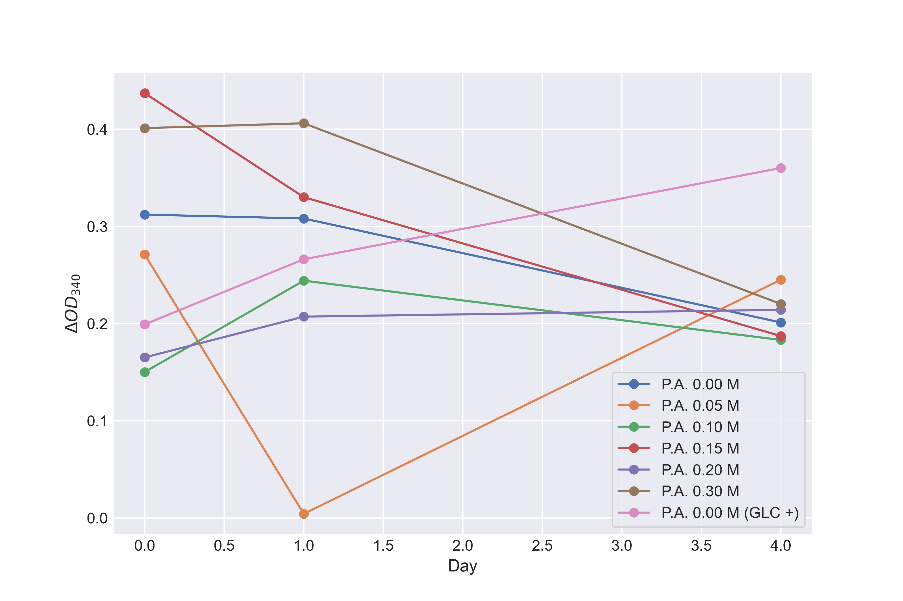

[トップへ戻る](README.md)

# グルコース定量実験 05/21

## 検量線の作成

### 検量線データ

| Glc(g/L) | 0     | 0.5  | 1.0  | 1.5  | 2.0   | 2.5  |
|:---------------:|-------|-------|-------|-------|-------|-------|
|$\text{OD}_{340}$   A1        | 0.000 | 0.004| -0.002 | 0.000 | 0.000  | -0.001 |
| $\text{OD}_{340}$  A2                  | 0.000 | 0.130| 0.255| 0.383|0.510 | 0.639 |
| $\Delta \text{OD}_{340}$           | 0.000 | 0.126| 0.257| 0.383|0.510 | 0.640 |

