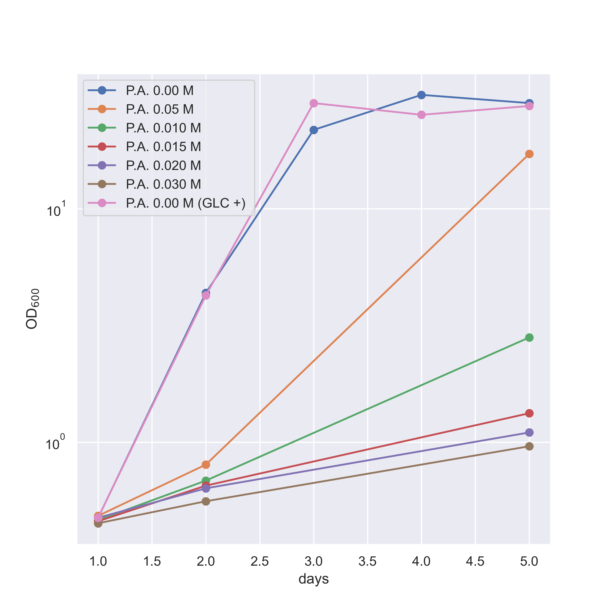

## １日目(05/13, 11:00)

前培養OD600 = 11.48

前培養pH = 5.030

### OD600

| P.A. conc.[M] | 0     | 0.05  | 0.1   | 0.15  | 0.2   | 0.3   |
|:---------------:|-------|-------|-------|-------|-------|-------|
| 補糖なし           | 0.473 | 0.483| 0.463 | 0.458 | 0.474  | 0.449 |
| 補糖あり           | 0.474 | - | - | -|-  | - |

### pH

| P.A. conc.[M] | 0     | 0.05  | 0.1   | 0.15  | 0.2   | 0.3   |
|:---------------:|-------|-------|-------|-------|-------|-------|
| 補糖なし           | 6.799 | 6.787 | 6.799 | 6.806 | 6.820 | 6.877 |
| 補糖あり           | 6.767 | - | - | -|-  | - |

## 2日目(05/14, 14:00)

### OD600

| P.A. conc.[M] | 0     | 0.05  | 0.1   | 0.15  | 0.2   | 0.3   |
|:---------------:|-------|-------|-------|-------|-------|-------|
| 補糖なし           | 0.436 | 0.801| 0.684 | 0.651 | 0.634 | 0.558 |
| 補糖あり           | 0.426 | - | - | -|-  | - |

### pH

| P.A. conc.[M] | 0     | 0.05  | 0.1   | 0.15  | 0.2   | 0.3   |
|:---------------:|-------|-------|-------|-------|-------|-------|
| 補糖なし           | 5.911 | 6.609 | 6.654 | 6.658 | 6.701 | 6.760 |
| 補糖あり           | 5.934 | - | - | -|-  | - |

## 3日目(05/15, 14:00)

### OD600

| P.A. conc.[M] | 0     | 0.05  | 0.1   | 0.15  | 0.2   | 0.3   |
|:---------------:|-------|-------|-------|-------|-------|-------|
| 補糖なし           | 21.8 | -| - | - | -| -|
| 補糖あり           | 18.4 | - | - | -|-  | - |

### pH 

| P.A. conc.[M] | 0     | 0.05  | 0.1   | 0.15  | 0.2   | 0.3   |
|:---------------:|-------|-------|-------|-------|-------|-------|
| 補糖なし           | 4.986 | -| - | - | -| -|
| 補糖あり           | 4.950 | - | - | -|-  | - |

## 4日目(05/16, 14:00)

### OD600

| P.A. conc.[M] | 0     | 0.05  | 0.1   | 0.15  | 0.2   | 0.3   |
|:---------------:|-------|-------|-------|-------|-------|-------|
| 補糖なし           | 30.8 | -| - | - | -| -|
| 補糖あり           | 25.3 | - | - | -|-  | - |

### pH 

| P.A. conc.[M] | 0     | 0.05  | 0.1   | 0.15  | 0.2   | 0.3   |
|:---------------:|-------|-------|-------|-------|-------|-------|
| 補糖なし           | 4.447 | -| - | - | -| -|
| 補糖あり           | 4.501 | - | - | -|-  | - |

## 最終日　5日目(05/16, 14:00)

### OD600

| P.A. conc.[M] | 0     | 0.05  | 0.1   | 0.15  | 0.2   | 0.3   |
|:---------------:|-------|-------|-------|-------|-------|-------|
| 補糖なし           | 28.4 | 17.2| 2.81 | 1.33 | 1.10| 0.96|
| 補糖あり           | 27.6 | - | - | -|-  | - |

### pH 

| P.A. conc.[M] | 0     | 0.05  | 0.1   | 0.15  | 0.2   | 0.3   |
|:---------------:|-------|-------|-------|-------|-------|-------|
| 補糖なし           | 4.418 | 4.801| 5.899| 6.268 | 6.318| 6.486|
| 補糖あり           | 4.465 | - | - | -|-  | - |

# 乾燥菌体重量

+→補糖あり
-→補糖なし
| P.A. conc.[M] |0 +  |0 -   | 0.05 -   | 0.1 -  | 0.15 - | 0.2 -   | 0.3 - |
|:---------------:|-------|-------|-------|-------|-------|-------|-------|
| 空ボトル重量 (g) | 14.6152 | 14.6538 | 14.6104| 14.5850| 14.6096| 14.6022|14.6309|
| 空ボトル＋乾燥菌体重量 (g)| 14.7366 | 14.7806 | 14.7006 | 14.6103|14.6304  | 14.6258 |14.6530 |
|乾燥菌体重量 (g)| 0.121 | 0.127 | 0.09 | 0.025|0.021  | 0.024 |0.022 |
