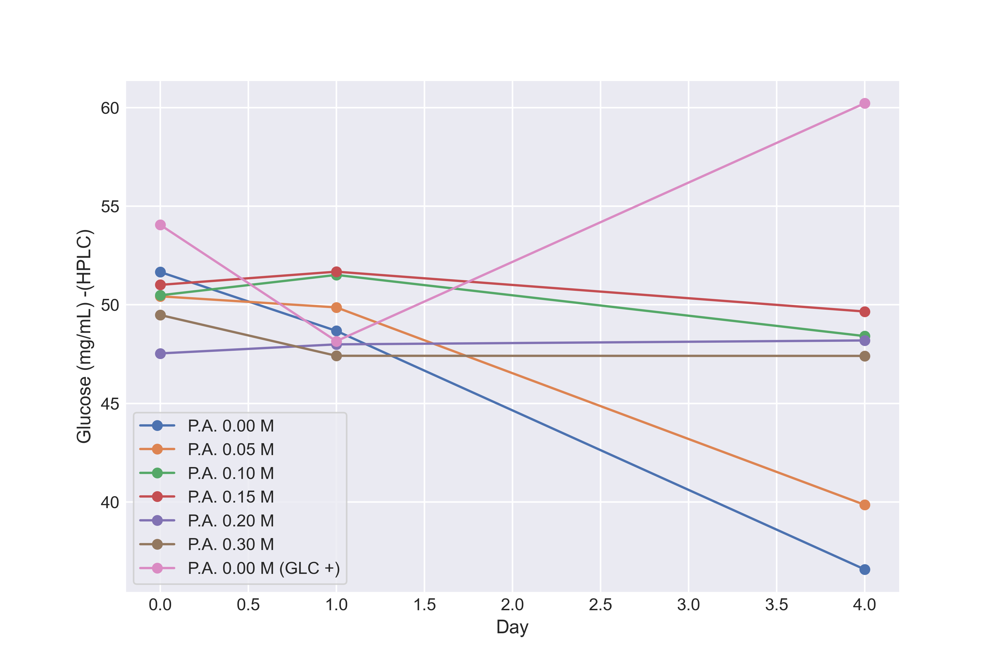

[トップへ戻る](README.md)

# P. shermanii 培養3回目 実験データ

## １日目(05/13, 11:00)

前培養OD600 = 11.48

前培養pH = 5.030

### OD600

| P.A. conc.[M] | 0     | 0.05  | 0.1   | 0.15  | 0.2   | 0.3   |
|:---------------:|-------|-------|-------|-------|-------|-------|
| 補糖なし           | 0.473 | 0.483| 0.463 | 0.458 | 0.474  | 0.449 |
| 補糖あり           | 0.474 | - | - | -|-  | - |


### pH

| P.A. conc.[M] | 0     | 0.05  | 0.1   | 0.15  | 0.2   | 0.3   |
|:---------------:|-------|-------|-------|-------|-------|-------|
| 補糖なし           | 6.799 | 6.787 | 6.799 | 6.806 | 6.820 | 6.877 |
| 補糖あり           | 6.767 | - | - | -|-  | - |


## 2日目(05/14, 14:00)

### OD600

| P.A. conc.[M] | 0     | 0.05  | 0.1   | 0.15  | 0.2   | 0.3   |
|:---------------:|-------|-------|-------|-------|-------|-------|
| 補糖なし           | 0.436 | 0.801| 0.684 | 0.651 | 0.634 | 0.558 |
| 補糖あり           | 0.426 | - | - | -|-  | - |


### pH

| P.A. conc.[M] | 0     | 0.05  | 0.1   | 0.15  | 0.2   | 0.3   |
|:---------------:|-------|-------|-------|-------|-------|-------|
| 補糖なし           | 5.911 | 6.609 | 6.654 | 6.658 | 6.701 | 6.760 |
| 補糖あり           | 5.934 | - | - | -|-  | - |

## 3日目(05/15, 14:00)

### OD600

| P.A. conc.[M] | 0     | 0.05  | 0.1   | 0.15  | 0.2   | 0.3   |
|:---------------:|-------|-------|-------|-------|-------|-------|
| 補糖なし           | 21.8 | -| - | - | -| -|
| 補糖あり           | 18.4 | - | - | -|-  | - |

### pH 

| P.A. conc.[M] | 0     | 0.05  | 0.1   | 0.15  | 0.2   | 0.3   |
|:---------------:|-------|-------|-------|-------|-------|-------|
| 補糖なし           | 4.986 | -| - | - | -| -|
| 補糖あり           | 4.950 | - | - | -|-  | - |


## 4日目(05/16, 14:00)

### OD600

| P.A. conc.[M] | 0     | 0.05  | 0.1   | 0.15  | 0.2   | 0.3   |
|:---------------:|-------|-------|-------|-------|-------|-------|
| 補糖なし           | 30.8 | -| - | - | -| -|
| 補糖あり           | 25.3 | - | - | -|-  | - |

### pH 

| P.A. conc.[M] | 0     | 0.05  | 0.1   | 0.15  | 0.2   | 0.3   |
|:---------------:|-------|-------|-------|-------|-------|-------|
| 補糖なし           | 4.447 | -| - | - | -| -|
| 補糖あり           | 4.501 | - | - | -|-  | - |

## 最終日　5日目(05/16, 14:00)

### OD600

| P.A. conc.[M] | 0     | 0.05  | 0.1   | 0.15  | 0.2   | 0.3   |
|:---------------:|-------|-------|-------|-------|-------|-------|
| 補糖なし           | 28.4 | 17.2| 2.81 | 1.33 | 1.10| 0.96|
| 補糖あり           | 27.6 | - | - | -|-  | - |


### pH 

| P.A. conc.[M] | 0     | 0.05  | 0.1   | 0.15  | 0.2   | 0.3   |
|:---------------:|-------|-------|-------|-------|-------|-------|
| 補糖なし           | 4.418 | 4.801| 5.899| 6.268 | 6.318| 6.486|
| 補糖あり           | 4.465 | - | - | -|-  | - |


# 乾燥菌体重量

(+)→補糖あり
(-)→補糖なし
| P.A. conc.[M] |0 +  |0 -   | 0.05 -   | 0.1 -  | 0.15 - | 0.2 -   | 0.3 - |
|:---------------:|-------|-------|-------|-------|-------|-------|-------|
| 空ボトル重量 (g) | 14.6152 | 14.6538 | 14.6104| 14.5850| 14.6096| 14.6022|14.6309|
| 空ボトル＋乾燥菌体重量 (g)| 14.7366 | 14.7806 | 14.7006 | 14.6103|14.6304  | 14.6258 |14.6530 |
|乾燥菌体重量 (g)| 0.121 | 0.127 | 0.09 | 0.025|0.021  | 0.024 |0.022 |

# グルコース定量データ(OD340)

## グルコース定量キットによるグルコース濃度測定結果


```Python

# なし 0
PA_000_A1 = [0.051, 0.050, 0.046]
PA_000_A2 = [0.363, 0.358, 0.247]
PA_000_DELTA_OD340 = delta(PA_000_A1, PA_000_A2)

# なし 0.05
PA_005_A1 = [0.048, 0.051, 0.051]
PA_005_A2 = [0.319, 0.055, 0.296]
PA_005_DELTA_OD340 = delta(PA_005_A1, PA_005_A2)


# なし 0.10
PA_010_A1 = [-0.001, -0.015, 0.050]
PA_010_A2 = [0.149, 0.229, 0.233]
PA_010_DELTA_OD340 = delta(PA_010_A1, PA_010_A2)


# なし 0.15
PA_015_A1 = [0.050, 0.082, 0.049]
PA_015_A2 = [0.487, 0.412, 0.236]
PA_015_DELTA_OD340 = delta(PA_015_A1, PA_015_A2)

# なし 0.20
PA_020_A1 = [0.051, 0.051, 0.050]
PA_020_A2 = [0.216, 0.258, 0.264]
PA_020_DELTA_OD340 = delta(PA_020_A1, PA_020_A2)

# なし 0.30
PA_030_A1 = [0.055, 0.069, 0.051]
PA_030_A2 = [0.456, 0.475, 0.271]
PA_030_DELTA_OD340 = delta(PA_030_A1, PA_030_A2)

# あり 0
PA_000_A1_GLC = [0.048, 0.048, 0.048]
PA_000_A2_GLC = [0.247, 0.314, 0.408]
PA_000_DELTA_OD340_GLC = delta(PA_000_A1_GLC, PA_000_A2_GLC)
```


以下の検量線を使用してOD340をglucose濃度に変換したデータ

[グルコース比色定量の検量線](Glucose_01.md)


## グルコース定量キットによるグルコース濃度測定結果(再測定)

```Python

# なし 0
PA_000_A1 = [0.051, 0.050, 0.046]
PA_000_A2 = [0.363, 0.358, 0.247]
PA_000_DELTA_OD340 = delta(PA_000_A1, PA_000_A2)

PA_000_GLU_A1 = [L.predict_x(i) for i in PA_000_DELTA_OD340]

# なし 0.05
PA_005_A1 = [0.048, -0.008, 0.051]
PA_005_A2 = [0.319, 0.308, 0.296]
PA_005_DELTA_OD340 = delta(PA_005_A1, PA_005_A2)

PA_005_GLU_A1 = [L.predict_x(i) for i in PA_005_DELTA_OD340]


# なし 0.10
PA_010_A1 = [0, -0.008, -0.008]
PA_010_A2 = [0.325, 0.298, 0.287]
PA_010_DELTA_OD340 = delta(PA_010_A1, PA_010_A2)

PA_010_GLU_A1 = [L.predict_x(i) for i in PA_010_DELTA_OD340]


# なし 0.15
PA_015_A1 = [0.050, 0.082, 0.049]
PA_015_A2 = [0.487, 0.412, 0.236]
PA_015_DELTA_OD340 = delta(PA_015_A1, PA_015_A2)

PA_015_GLU_A1 = [L.predict_x(i) for i in PA_015_DELTA_OD340]

# なし 0.20
PA_020_A1 = [0.051, 0.051, 0.050]
PA_020_A2 = [0.216, 0.258, 0.264]
PA_020_DELTA_OD340 = delta(PA_020_A1, PA_020_A2)

PA_020_GLU_A1 = [L.predict_x(i) for i in PA_020_DELTA_OD340]

# なし 0.30
PA_030_A1 = [0.055, 0.069, 0.051]
PA_030_A2 = [0.456, 0.475, 0.271]
PA_030_DELTA_OD340 = delta(PA_030_A1, PA_030_A2)

PA_030_GLU_A1 = [L.predict_x(i) for i in PA_030_DELTA_OD340]

# あり 0
PA_000_A1_GLC = [0.048, 0.048, 0.048]
PA_000_A2_GLC = [0.247, 0.314, 0.408]
PA_000_DELTA_OD340_GLC = delta(PA_000_A1_GLC, PA_000_A2_GLC)

PA_000_GLU_A1_GLC = [L.predict_x(i) for i in PA_000_DELTA_OD340_GLC]
```


## HPCLによるグルコース濃度測定結果


