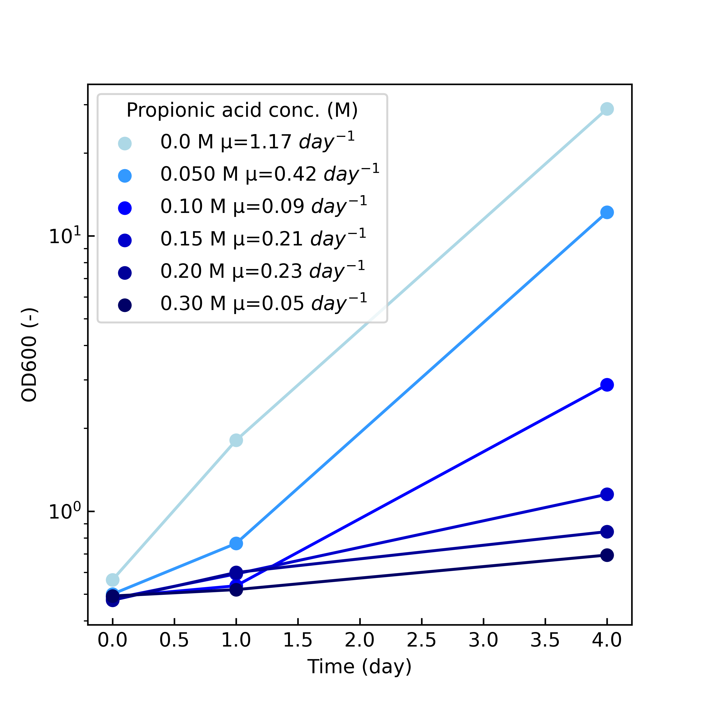

# プレ学生実験データ

# V.B12 比色定量

シアノコバラミンの吸収極大波長は360nmまたは、550nmにある。

短波長の方が分解能が高いと考え、360nmを採用。

| V.B.12 (µg/mL) | OD360  |
| ---- | ------ |
| 0.00    | 0.000      |
| 0.25 | 0.005  |
| 0.50  | 0.009  |
| 1.0    | 0.02   |
| 2.0   | 0.04   |
| 2.5  | 0.047  |
| 4.0    | 0.087  |
| 5.0   | 0.103  |


## V.B12算出のためのOD360実測データ(5/1)

| 有機酸濃度(M) | 補糖ありOD360(n=1) | 補糖なしOD360(n=1) | 補糖ありOD360(n=2) | 補糖なしOD360(n=2)|
|-------------|-------------|-------------|-------------|-------------|
| 0.00        | 0.444       | 0.269       | 0.329       | 0.244       |
| 0.050        | 0.175       | 0.253       | 0.125       | 0.216       |
| 0.10         | 0.162       | 0.156       | 0.126       | 0.119       |
| 0.15        | 0.113       | 0.025       | 0.078       | 0.025       |
| 0.20         | 0.135       | 0.129       | 0.098       | 0.079       |
| 0.30         | 0.089       | 0.099       | 0.04        | 0.074       |

## V.B12算出結果

### n = 1
[21.285714285714285, 8.476190476190474, 7.857142857142857, 5.523809523809524, 6.571428571428571, 4.3809523809523805]
[12.952380952380953, 12.19047619047619, 7.571428571428571, 1.3333333333333333, 6.285714285714286, 4.857142857142857]
検量線を用いた算出結果


| 有機酸濃度(M) | 補糖ありV.B12濃度(µM,n=1) | 補糖なしV.B12濃度(µM,n=1) | 
|-------------|-------------|-------------|
| 0.00        | 21.29      | 12.95      | 
| 0.050        | 8.48     | 12.19     |
| 0.10         | 7.86      | 7.57     | 
| 0.15        | 5.52       | 1.33     | 
| 0.20         | 6.57     | 6.29     | 
| 0.30         | 4.38       | 4.86     | 


### n = 2

検量線を用いた算出結果


# 培養
[エクセルデータ](OD600_PH_data_raw.xlsx)
## １日目(04/22, 22:00)

前培養OD600 = 11.27

### OD600

| プロピオン酸濃度[M] | 0     | 0.05  | 0.1   | 0.15  | 0.2   | 0.3   |
|:---------------:|-------|-------|-------|-------|-------|-------|
| 補糖あり           | 0.563 | 0.5   | 0.488 | 0.481 | 0.475 | 0.492 |
| 補糖なし           | 0.504 | 0.504 | 0.495 | 0.491 | 0.48  | 0.491 |

### pH

| プロピオン酸濃度[M] | 0     | 0.05  | 0.1   | 0.15  | 0.2   | 0.3   |
|:---------------:|-------|-------|-------|-------|-------|-------|
| 補糖あり           | 6.516 | 6.439 | 6.415 | 6.477 | 6.487 | 6.602 |
| 補糖なし           | 6.457 | 6.426 | 6.428 | 6.529 | 6.576 | 6.587 |


## 2日目 (04/23, 22:00)

### OD600

| プロピオン酸濃度[M] | 0     | 0.05  | 0.1   | 0.15  | 0.2   | 0.3   |
|----------|-------|-------|-------|-------|-------|-------|
| 補糖あり    | 1.81  | 0.764 | 0.536 | 0.592 | 0.599 | 0.519 |
| 補糖なし    | 1.74  | 0.475 | 0.674 | 0.628 | 0.541 | 0.683 |

### pH

| プロピオン酸濃度[M] | 0     | 0.05  | 0.1   | 0.15  | 0.2   | 0.3   |
|----------|-------|-------|-------|-------|-------|-------|
| 補糖あり    | 6.442 | 6.44  | 6.466 | 6.519 | 6.535 | 6.651 |
| 補糖なし    | 6.09  | 6.641 | 6.47  | 6.57  | 6.591 | 6.422 |

## 最終日 (04/26, 21:00)

### OD600
| プロピオン酸濃度[M] | 0     | 0.05  | 0.1   | 0.15  | 0.2   | 0.3   |
|----------|-------|-------|-------|-------|-------|-------|
| 補糖あり    | 28.95 | 12.2 | 2.88 | 1.152 | 0.843 | 0.693 |
| 補糖なし    | 34.2  | 15.45 | 3.22 | 1.152 | 0.864 | 0.693 |

### pH

| プロピオン酸濃度[M] | 0     | 0.05  | 0.1   | 0.15  | 0.2   | 0.3   |
|----------|-------|-------|-------|-------|-------|-------|
| 補糖あり    | 4.754 | 5.303 | 6.216 | 6.532 | 6.506 | 6.638 |
| 補糖なし    | 4.603  | 5.11 | 6.143 | 6.44 | 6.524 | 6.88 |


# 結果

## OD600の推移

### 補糖あり



### 補糖なし


## pHの推移

### 補糖あり


### 補糖なし


# Setup a python virtual environment 

1. Create a virtual environment for python3

```Bash
python3 -m venv venv
```
2. Activate the venv

```Bash
source venv/bin/activate
```
3. Leave the environment 

```Bash
deactivate
```

# Commands

## UPDATE requirements.txt

```Bash
pip freeze > requirements.txt
```
