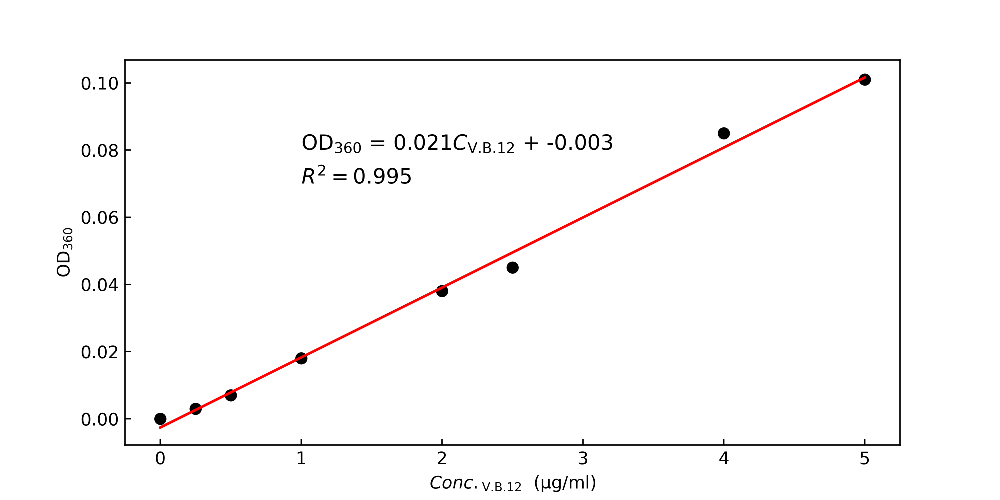
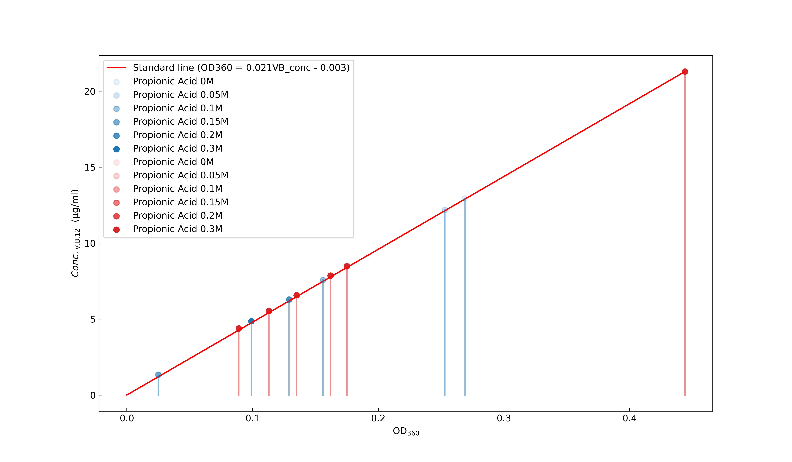
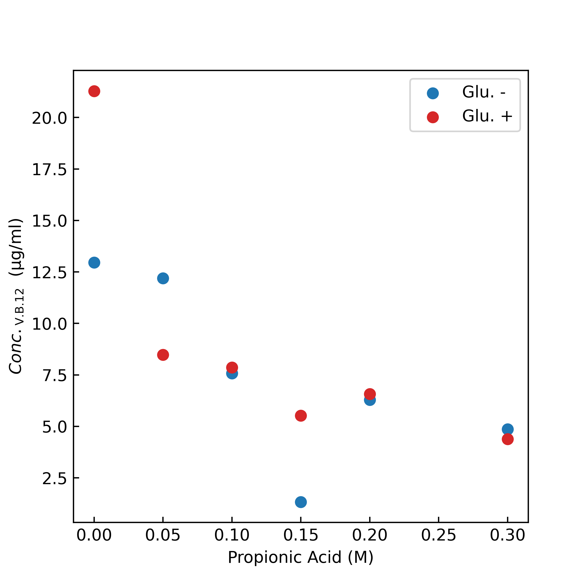
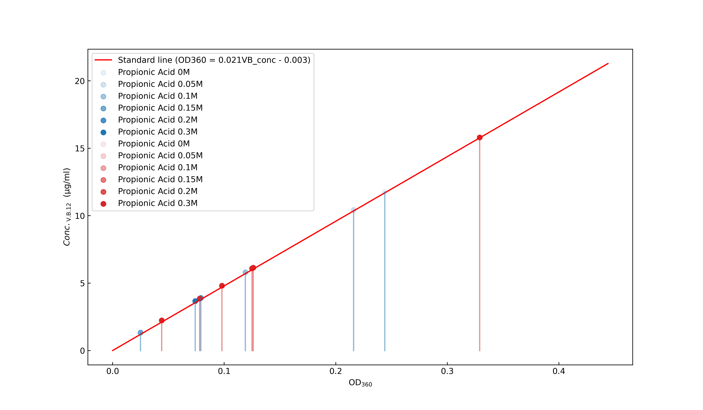
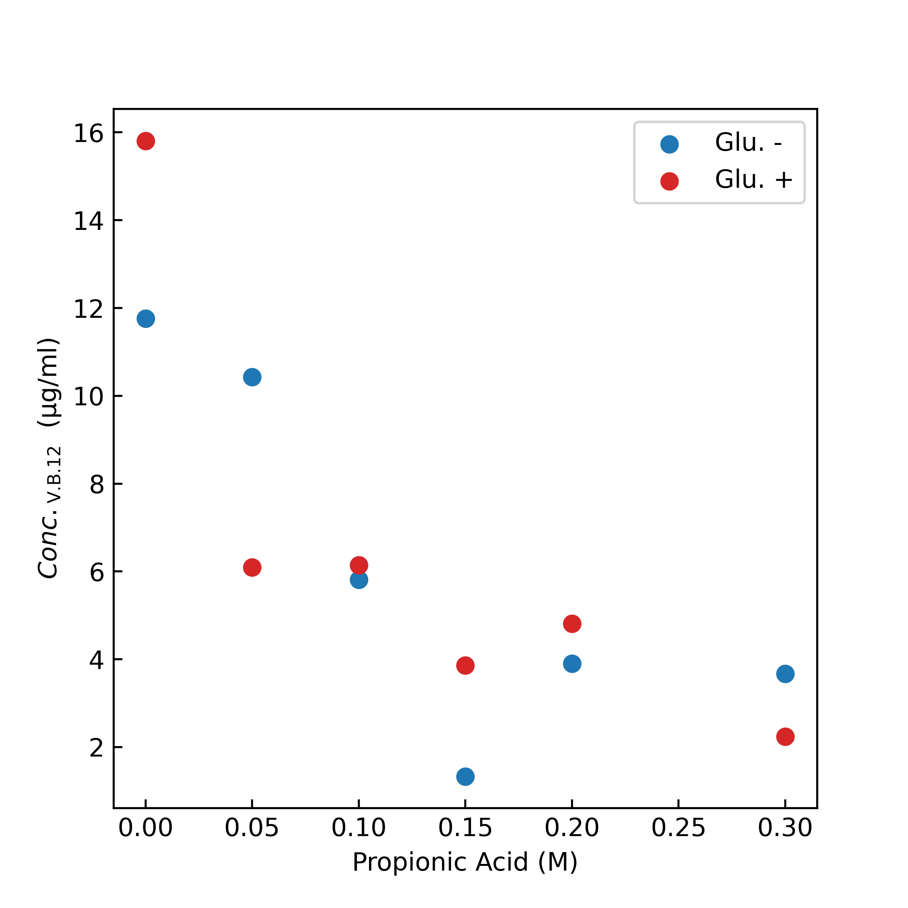

# V.B12 比色定量

シアノコバラミンの吸収極大波長は360nmまたは、550nmにある。

短波長の方が分解能が高いと考え、360nmを採用。

| V.B.12 (µg/mL) | OD360  |
| ---- | ------ |
| 0.00    | 0.000      |
| 0.25 | 0.005  |
| 0.50  | 0.009  |
| 1.0    | 0.02   |
| 2.0   | 0.04   |
| 2.5  | 0.047  |
| 4.0    | 0.087  |
| 5.0   | 0.103  |



## V.B12算出のためのOD360実測データ(5/1)

| 有機酸濃度(M) | 補糖ありOD360(n=1) | 補糖なしOD360(n=1) | 補糖ありOD360(n=2) | 補糖なしOD360(n=2)|
|-------------|-------------|-------------|-------------|-------------|
| 0.00        | 0.444       | 0.269       | 0.329       | 0.244       |
| 0.050        | 0.175       | 0.253       | 0.125       | 0.216       |
| 0.10         | 0.162       | 0.156       | 0.126       | 0.119       |
| 0.15        | 0.113       | 0.025       | 0.078       | 0.025       |
| 0.20         | 0.135       | 0.129       | 0.098       | 0.079       |
| 0.30         | 0.089       | 0.099       | 0.04        | 0.074       |

## V.B12算出結果

### n = 1

検量線を用いた算出結果




| 有機酸濃度(M) | 補糖ありV.B12濃度(µM,n=1) | 補糖なしV.B12濃度(µM,n=1) | 
|-------------|-------------|-------------|
| 0.00        | 21.29      | 12.95      | 
| 0.050        | 8.48     | 12.19     |
| 0.10         | 7.86      | 7.57     | 
| 0.15        | 5.52       | 1.33     | 
| 0.20         | 6.57     | 6.29     | 
| 0.30         | 4.38       | 4.86     | 




### n = 2

検量線を用いた算出結果



| 有機酸濃度(M) | 補糖ありV.B12濃度(µM,n=1) | 補糖なしV.B12濃度(µM,n=1) | 
|-------------|-------------|-------------|
| 0.00        | 15.8     | 11.8     | 
| 0.050        | 6.10     | 10.4     |
| 0.10         | 6.14      | 5.8     | 
| 0.15        | 3.85       | 1.33     | 
| 0.20         | 4.80    | 3.90     | 
| 0.30         | 2.24       | 3.67     | 



# 検量線の作成


# Fitting scripts

```Python
import matplotlib.pyplot as plt
from sklearn.metrics import r2_score as R2_
import numpy as np
from numpy.linalg import inv


class VB12:
    def __init__(self, conc: list[float], OD360: list[float], blank: float) -> None:
        self.blank: float = blank
        self.conc: list[float] = conc
        self.OD360: list[float] = [
            OD360[i] - self.blank if i != 0 else OD360[i] for i in range(len(OD360))
        ]
        X, Y = np.array([[1, i] for i in self.conc]), np.array(self.OD360).reshape(
            -1, 1
        )
        self.theta: list[float] = inv(X.T @ X) @ X.T @ Y
        self.r2: float = R2_(Y, [self.theta[0] + self.theta[1] * i for i in self.conc])

    def __repr__(self) -> str:
        return f"STD. line : {self.theta[1][0]:.3f}C_V.B.12 + {self.theta[0][0]:.3f}, R^2 = {self.r2:.3f}"

    def convert_OD360(self, OD360: float) -> float:
        return (OD360 - self.theta[0][0]) / self.theta[1][0]


# 検量線作成用のデータ

### ブランクのOD360 ###
blank: float = 0.002
### conc. V.B12　標準液(µg/ml) ###
conc: list[float] = [0, 0.25, 0.5, 1, 2, 2.5, 4, 5]
### OD360 nm ###
OD360: list[float] = [0, 0.005, 0.009, 0.02, 0.04, 0.047, 0.087, 0.103]


# 実行例
vb12 = VB12(conc, OD360, blank)
print(vb12)
print([vb12.convert_OD360(i) for i in [0.01, 0.02, 0.03, 0.04, 0.05]])

```