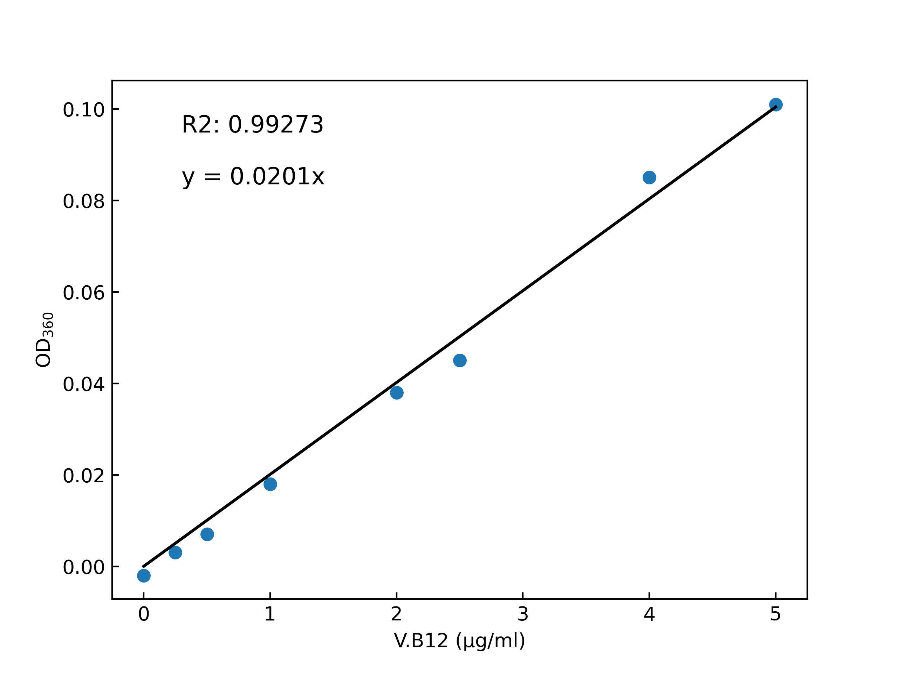

[トップへ戻る](../README.md)

# V.B12 比色定量

シアノコバラミンの吸収極大波長は360nmまたは、550nmにある。

短波長の方が分解能が高いと考え、360nmを採用。

| V.B.12 (µg/mL) | OD360  |
| ---- | ------ |
| 0.00    | 0.000      |
| 0.25 | 0.005  |
| 0.50  | 0.009  |
| 1.0    | 0.02   |
| 2.0   | 0.04   |
| 2.5  | 0.047  |
| 4.0    | 0.087  |
| 5.0   | 0.103  |

