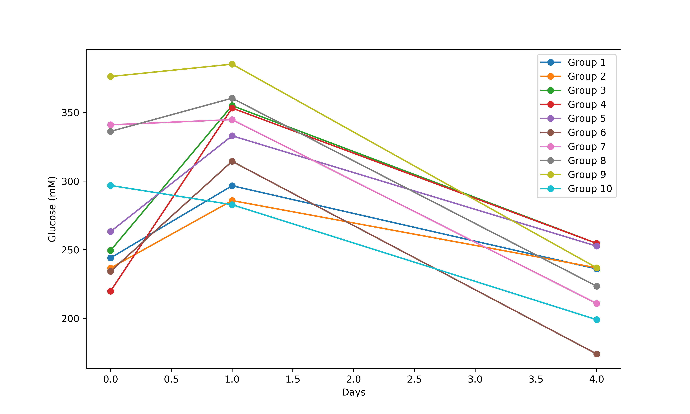
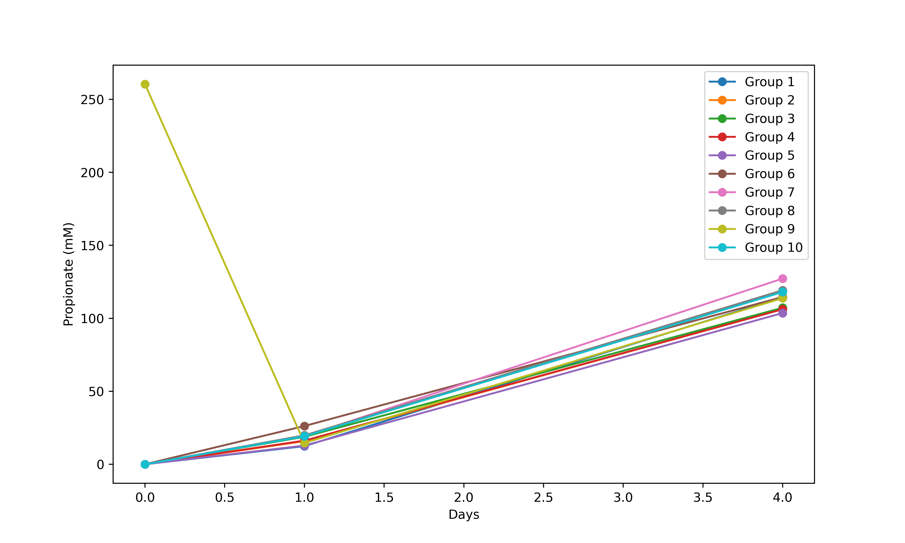

# HPLC測定結果

#　グラフ

## 有機酸ありグルコース

## 有機酸なしグルコース

## 有機酸ありプロピオン酸

## 有機酸なしプロピオン酸

## Day0 

### 有機酸あり

| 班 | グルコース | プロピオン酸 |
|----|------------|--------------|
| 1  | 13.51      | 2.21         |
| 2  | 13.19      | 4.48         |
| 3  | 14.63      | 7.48         |
| 4  | 13.03      | 8.99         |
| 5  | 14.92      | 15.44        |
| 6  | 14.78      | 2.12         |
| 7  | 13.85      | 4.7          |
| 8  | 12.53      | 6.38         |
| 9  | 12.56      | N/A          |
| 10 | 14.55      | 15.61        |

### 有機酸なし

| 班 | グルコース | プロピオン酸 |
|----|------------|----------------|
| 1  | 12.2       | N/A            |
| 2  | 11.83      | N/A            |
| 3  | 12.47      | N/A            |
| 4  | 10.99      | N/A            |
| 5  | 13.16      | N/A            |
| 6  | 11.71      | N/A            |
| 7  | 17.05      | N/A            |
| 8  | 16.81      | N/A            |
| 9  | 18.81      | 13.02          |
| 10 | 14.84      | N/A            |

## Day1

### 有機酸あり

| 班 | グルコース | プロピオンさん |
|----|------------|----------------|
| 1  | 15.34      | 2.69           |
| 2  | 11.39      | 3.99           |
| 3  | 12.83      | 6.89           |
| 4  | 18.02      | 12.75          |
| 5  | 12.7       | 13.22          |
| 6  | 13.76      | 2.14           |
| 7  | 13.81      | 4.69           |
| 8  | 12.28      | 6.36           |
| 9  | 12.45      | 8.64           |
| 10 | 14.93      | 16.18          |

### 有機酸なし

| 班 | グルコース | プロピオンさん | 酢酸 |
|----|------------|----------------|------|
| 1  | 14.83      | 0.62           | 0.23 |
| 2  | 14.29      | 0.79           | 0.3  |
| 3  | 17.75      | 0.94           | N/A  |
| 4  | 17.66      | 0.81           | N/A  |
| 5  | 16.65      | 0.64           | N/A  |
| 6  | 15.72      | 1.31           | N/A  |
| 7  | 17.24      | 0.96           | N/A  |
| 8  | 18.02      | 0.99           | 0.4  |
| 9  | 19.26      | 0.73           | N/A  |
| 10 | 14.14      | 0.96           | 0.38 |

## Day4 

### 有機酸あり

| 班 | グルコース | プロピオンさん | 酢酸 |
|----|------------|----------------|------|
| 1  | 13         | 7.36           | N/A  |
| 2  | 15.26      | 6.75           | 0.53 |
| 3  | 15.27      | 8.35           | N/A  |
| 4  | 15.85      | 11.43          | N/A  |
| 5  | 15.85      | 16.87          | N/A  |
| 6  | 13.61      | 6.53           | N/A  |
| 7  | 14.68      | 7.68           | N/A  |
| 8  | 14.98      | 8.58           | N/A  |
| 9  | 16.45      | 11.89          | 0.13 |
| 10 | 15.47      | 17.32          | N/A  |

### 有機酸なし

| 班 | グルコース | プロピオンさん | 酢酸 |
|----|------------|----------------|------|
| 1  | 11.8       | 5.72           | N/A  |
| 2  | 11.84      | 5.31           | N/A  |
| 3  | 12.73      | 5.36           | 1.72 |
| 4  | 12.73      | 5.31           | N/A  |
| 5  | 12.63      | 5.18           | N/A  |
| 6  | 8.7        | 5.73           | N/A  |
| 7  | 10.54      | 6.36           | N/A  |
| 8  | 11.17      | 5.96           | N/A  |
| 9  | 11.84      | 5.69           | N/A  |
| 10 | 9.95       | 5.9            | N/A  |
